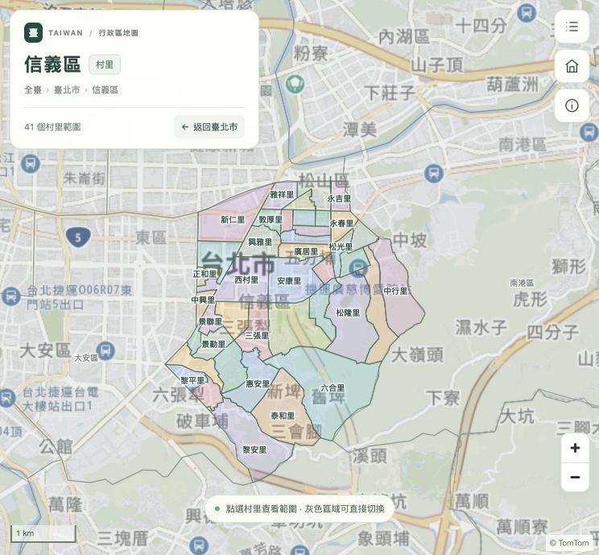
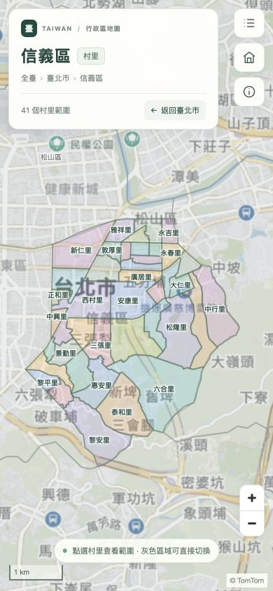
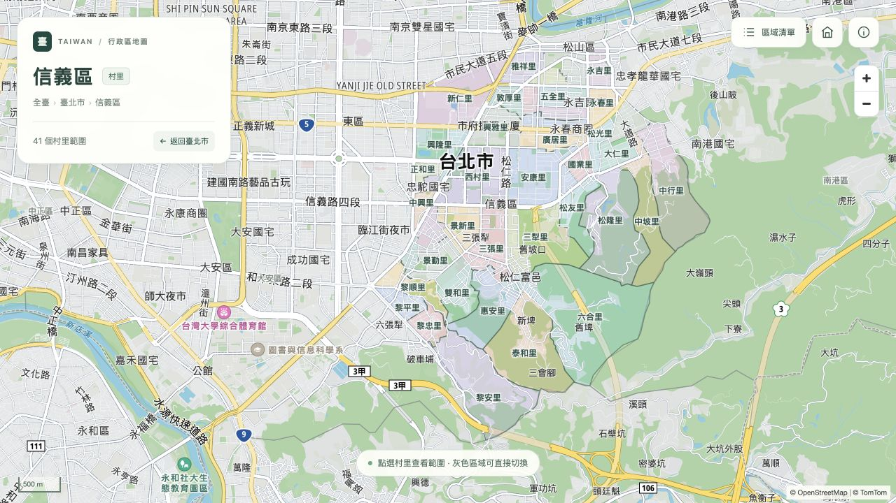
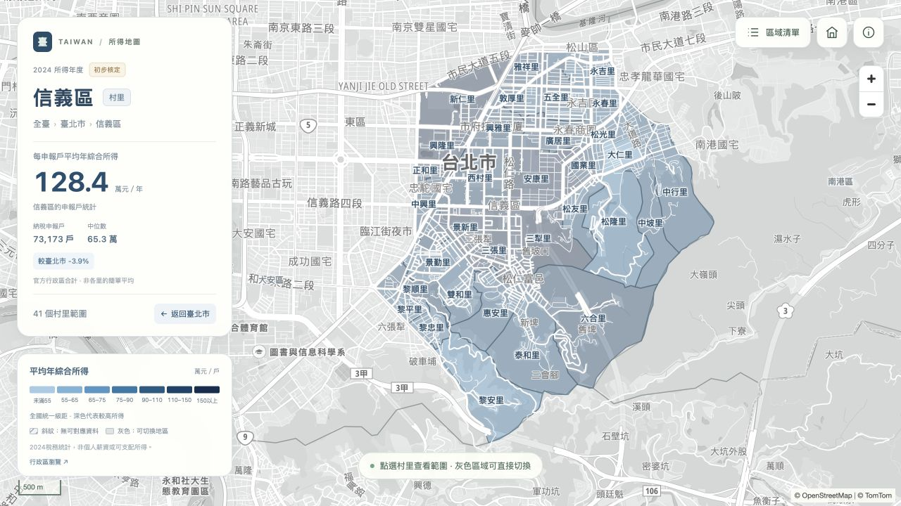
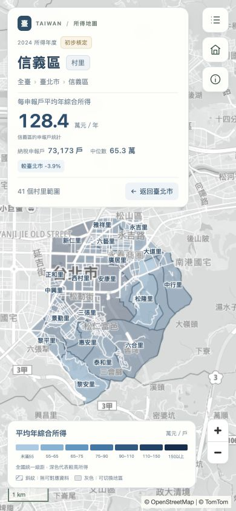
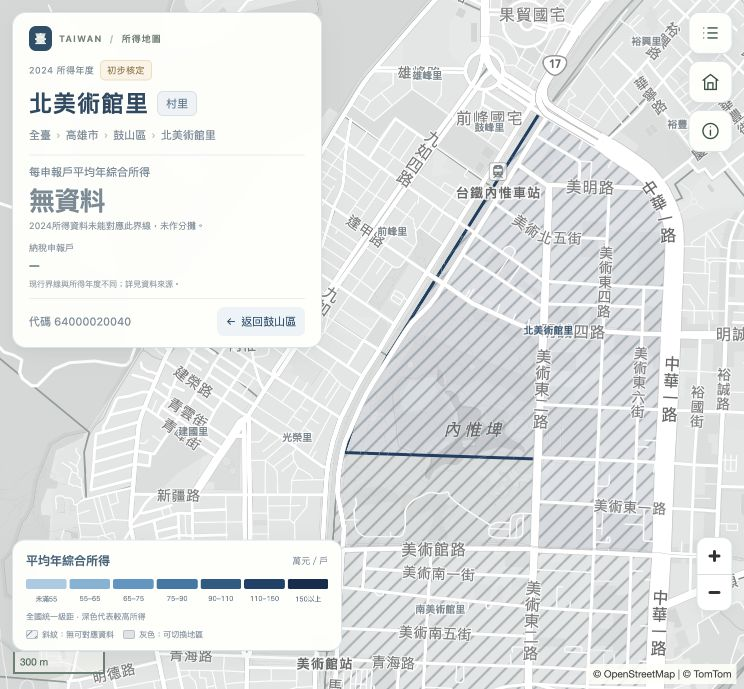
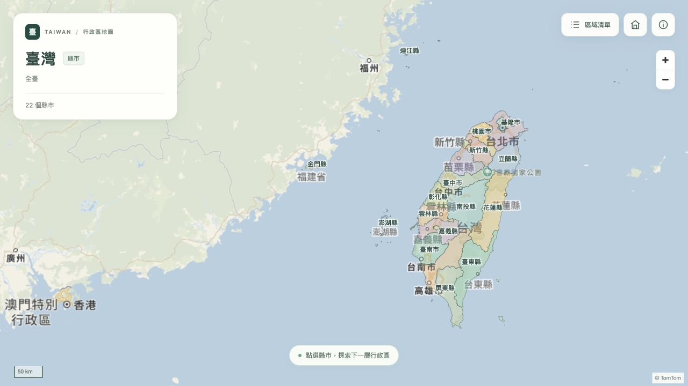
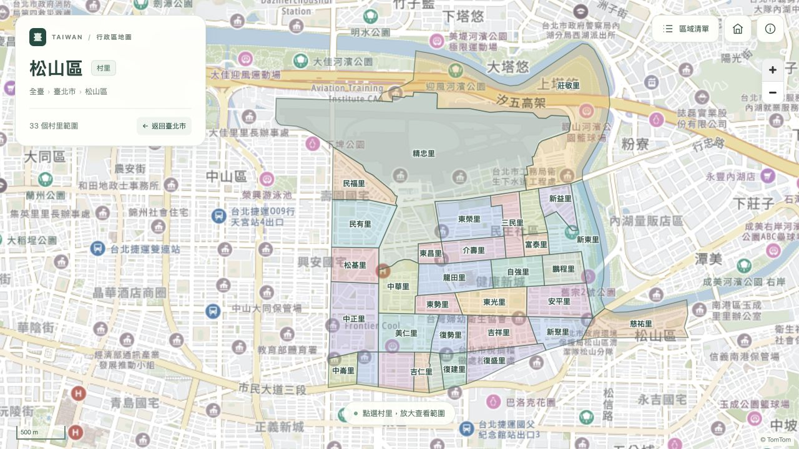
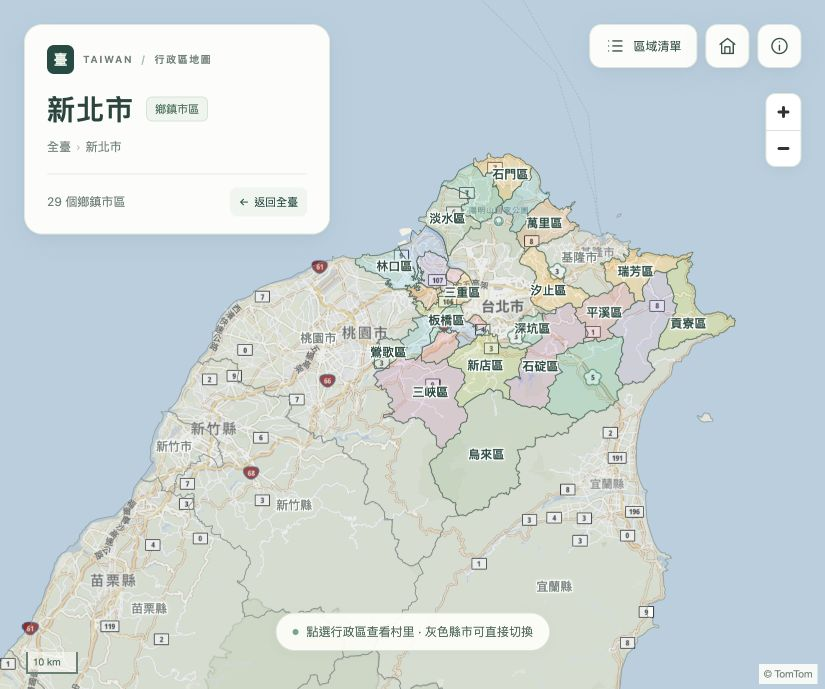
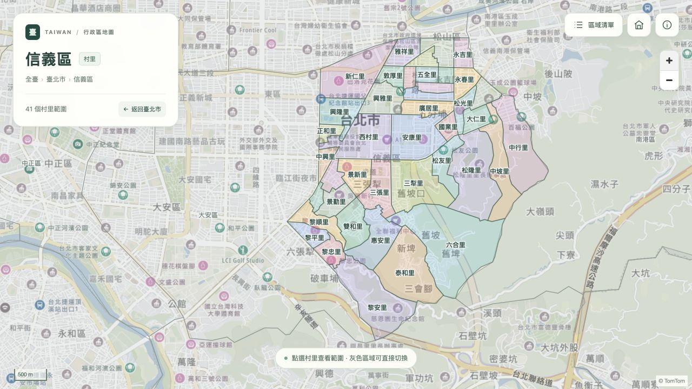

# 驗證紀錄

驗證日期：2026-10-07。以下原有紀錄為發布前的本機驗證；GitHub Pages 狀態另見下方。

## GitHub Pages 部署驗證

2026-10-07 建立公開 repo `weihuatw/TaiwanDistrictMap`，推送 `main` 並啟用 GitHub Actions 作為 Pages 發布來源，預定網址為 `https://weihuatw.github.io/TaiwanDistrictMap/`。

- 本機 29 個 Node 測試、2 個 Python 測試、`data:check`、`income:check` 與 `/TaiwanDistrictMap/` base 建置全部通過。
- 實際瀏覽器載入該子路徑下的行政區與所得兩個入口，行政區頁 TomTom 向量來源記錄 `data-basemap-loaded="true"`、`data-basemap-type="vector"`、`data-ready="true"`。
- 所得頁依序選取臺北市與信義區，顯示 133.6 萬、128.4 萬及 41 個村里範圍，確認分層圖資與所得檔案的子路徑正常。
- Git 提交排除 `.env.local`、原始資料、`node_modules/` 與 `dist/`；所有提交檔案已檢查不含本機 TomTom key。
- 首次 Actions 執行已完成測試及兩種資料檢查，在 `Check basemap key` 因尚未設定 `VITE_TOMTOM_API_KEY` Secret 停止，未發布線上網站。Key 傳送等待使用者明確同意。

- `npm test`：29 個Node測試及2個Python報表解析測試通過，涵蓋導覽、所得資料、同層切換、請求競態、重試、配色、圖資快取與頁面清理。
- `npm run data:check`：22 縣市、368 鄉鎮市區、7,986 村里圖形通過代碼、父子關係、環閉合、座標及標籤位置檢查。
- `npm run build`：TypeScript 與 Vite 建置成功；地圖套件造成主要程式檔大於 500 kB 的提示。
- npm 安裝時的相依套件稽核：0 個已知漏洞。
- 瀏覽器實測：TomTom 底圖、臺北市 → 松山區 → 精忠里、逐層返回、清單搜尋、首頁重設、資料來源視窗。
- 灰色範圍實測：臺北市 → 新北市 → 臺北市、信義區 → 大安區，以及切換後返回臺北市。只保留目前選取區域的下一層彩色界線，周邊縣市與同層行政區維持灰色。
- 離島實測：金門縣 → 金城鎮 → 村里；無 key 預覽模式的連江縣及返回。
- 手機實測：390 × 844，搜尋「台北」、清單選區與村里展示，並從信義區點擊灰色松山區直接切換。
- 靜態建置實測：Vite preview 載入 TomTom、縣市、行政區及村里，從信義區點擊灰色大安區切換成功；未觀察到瀏覽器錯誤。修正 SDK 樣式載入順序造成的縮放按鈕與工具列重疊。

## 模組拆分後的驗證

2026-10-07 拆分後重新執行 21 項測試、全量圖資檢查及 TypeScript / Vite 建置，全部通過。

- 本機開發版：TomTom 底圖載入、搜尋「台北」、臺北市行政區與信義區村里顯示正常。
- 靜態建置版：以地圖 polygon 點擊臺北市 → 信義區 → 廣居里，顯示村里代碼與選取卡片；返回信義區正常。
- 靜態建置版：點擊灰色大安區，顯示 53 個村里範圍；返回臺北市後點擊灰色新北市，顯示 29 個行政區。資料來源視窗正常。
- 手機尺寸：在背景靜態版的實際 390 × 844 viewport 驗證清單自動收合、信義區 41 個村里顯示，以及點擊灰色松山區切換至 33 個村里範圍。測試後清除尺寸覆寫。
- 無 key 模式：以暫時的環境變數覆寫測試，不修改 `.env.local`；連江縣 → 南竿鄉的 48 個村里圖形（含未編定範圍）正常載入。
- 靜態版與無 key 模式未觀察到瀏覽器警告或錯誤。本機主要 server 保留在 5173，暫時的測試 server 關閉。

## Vector 底圖切換

2026-10-07 底圖由 raster 改為 TomTom SDK 的 `standardLight` vector style，使用 `zh-Hant`，選用模組設為空陣列。

- 靜態版實際讀取 `vectorTiles` 底圖來源後，地圖容器記錄 `data-basemap-type="vector"`、`data-basemap-loaded="true"`、`data-ready="true"`。
- 臺北市 → 信義區 → 廣居里、返回信義區、點擊灰色大安區及返回臺北市均正常。道路及地名由向量圖層繪製，行政區填色與輪廓位於底圖 symbol 圖層下方。
- 21 項測試與 TypeScript / Vite 建置通過，靜態版未觀察到瀏覽器警告或錯誤。
- `.env.local` 未修改，本機主要 server 保留在 5173。

## 2024所得地圖

2026-10-07 新增獨立 `income.html`。`npm test`（29個Node＋2個Python）、`income:check`、`data:check`及雙HTML入口建置皆通過。

- 官方2024初步核定HTML已取得、保存SHA256，22縣市的戶數與鄉鎮合計完全一致；所得金額核對容許官方千元捨入差。
- 對應22縣市、368鄉鎮市區、7,734村里，申報戶數覆蓋99.76%。46個現行具名村里與206個未編定範圍未對應，顯示斜紋與「無資料」。
- 開發版實測：臺北市133.6萬 → 信義區128.4萬 → 廣居里135.5萬；返回恢復對應平均值，灰色松山區切換顯示155.6萬及33個村里。
- 缺資料實測：高雄市 → 鼓山區 → 北美術館里，顯示「無資料」及斜紋，未將龍水里舊統計分配給拆分後的里。
- 靜態建置版實測：獨立入口載入、TomTom vector來源、分層所得數值、來源視窗的最新覆蓋率。
- 手機實測：390×844，信義區村里圖形、所得卡片、七階圖例、清單選取廣居里、自動收合及返回正常。
- 原行政區頁回歸：臺北市 → 信義區，原本配色與41個村里顯示正常，沒有所得面板。
- 實際重建界線，確認所得主題資料被保留；後續重新建置所得並通過兩種資料檢查。

## 先前版本畫面

資料採官方全國主圖層，另附且與主圖層重疊的瑪家鄉／三和村補充範圍未混入展示。版本及這項處理選擇已記錄於 README 與資料來源視窗。
